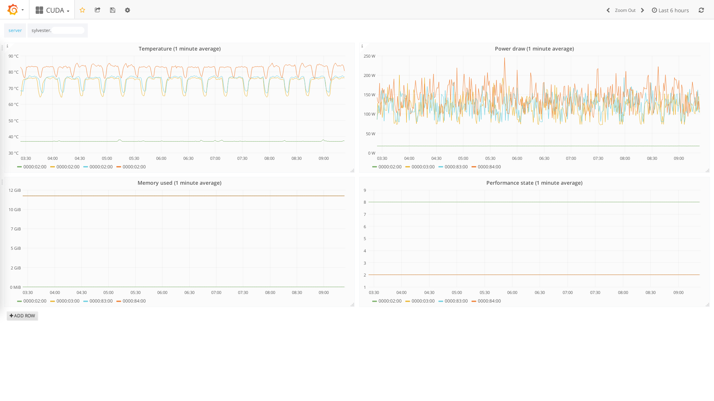

# collectd-cuda

The project contains `collectd` CUDA `exec` plugin for collecting nVidia
GPU metrics. The plugin works well with single and multi-GPU machines.

## Installation

First, make sure that the `collectd` `exec` plugin is loaded. Uncomment
or add the following line to your `collectd.conf`:
```
LoadPlugin exec
```
Then, add the path to `collectd_cuda.sh` in `exec` configuration.
The configuration file, `plugins_config.sh`, is in a separate file and is
required by the main script.
```
<Plugin exec>                                                                   
    Exec some_user "/path/to/collectd_cuda.sh"                       
</Plugin>
```

## Sample output

Depending on the metrics selection, the plugin will return `PUTVAL` Plain Text
Protocol [messages](https://collectd.org/documentation/manpages/collectd-exec.5.shtml).
You can find below the sample output from the server with four **TitanX** cards.
```
PUTVAL server.fqdn/cuda-0000:02:00.0/percent-fan_speed interval=10 N:23
PUTVAL server.fqdn/cuda-0000:02:00.0/memory-memory_free interval=10 N:11172
PUTVAL server.fqdn/cuda-0000:02:00.0/temperature-temperature_gpu interval=10 N:32
PUTVAL server.fqdn/cuda-0000:02:00.0/power-power_draw interval=10 N:16.87
PUTVAL server.fqdn/cuda-0000:02:00.0/memory-memory_used interval=10 N:0
PUTVAL server.fqdn/cuda-0000:03:00.0/percent-fan_speed interval=10 N:23
PUTVAL server.fqdn/cuda-0000:03:00.0/memory-memory_free interval=10 N:11172
PUTVAL server.fqdn/cuda-0000:03:00.0/temperature-temperature_gpu interval=10 N:36
PUTVAL server.fqdn/cuda-0000:03:00.0/power-power_draw interval=10 N:17.08
PUTVAL server.fqdn/cuda-0000:03:00.0/memory-memory_used interval=10 N:0
PUTVAL server.fqdn/cuda-0000:83:00.0/percent-fan_speed interval=10 N:23
PUTVAL server.fqdn/cuda-0000:83:00.0/memory-memory_free interval=10 N:11172
PUTVAL server.fqdn/cuda-0000:83:00.0/temperature-temperature_gpu interval=10 N:35
PUTVAL server.fqdn/cuda-0000:83:00.0/power-power_draw interval=10 N:16.88
PUTVAL server.fqdn/cuda-0000:83:00.0/memory-memory_used interval=10 N:0
PUTVAL server.fqdn/cuda-0000:84:00.0/percent-fan_speed interval=10 N:23
PUTVAL server.fqdn/cuda-0000:84:00.0/memory-memory_free interval=10 N:11172
PUTVAL server.fqdn/cuda-0000:84:00.0/temperature-temperature_gpu interval=10 N:42
PUTVAL server.fqdn/cuda-0000:84:00.0/power-power_draw interval=10 N:17.37
PUTVAL server.fqdn/cuda-0000:84:00.0/memory-memory_used interval=10 N:0
```

## Customization

Metrics can be added or removed from the `config` array.
```shell
declare -A config=(                                                             
    ["temperature_gpu"]=temperature                                             
    ["fan_speed"]=percent                                                       
    ["memory_used"]=memory                                                      
    ["memory_free"]=memory                                                      
    ["utilization_gpu"]=percent                                                 
    ["utilization_memory"]=percent                                              
    ["power_draw"]=power                                                        
)
```
Each entry should be in the following format:
```shell
["metric_name"]=value_type
```
Any query string from `nvidia-smi` can be a `metric_name`, but each dot `.`
has to be replaced by an underscore `_`. For example, `temperature.gpu`
becomes `temperature_gpu`.

The full list of query options can be obtained with the following command:
```shell
nvidia-smi --help-query-gpu
```

## Graphs with Grafana

I store my metrics in the [InfluxDB](https://www.influxdata.com/) and
visualize them with [Grafana](https://grafana.com/). You can find below a sample
dashboard from one of the servers I administer.


